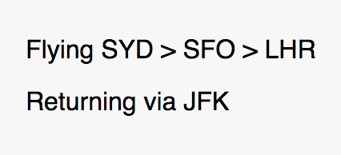
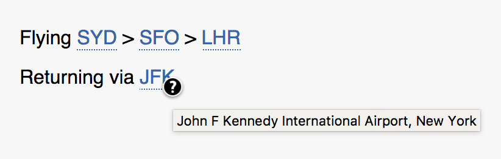
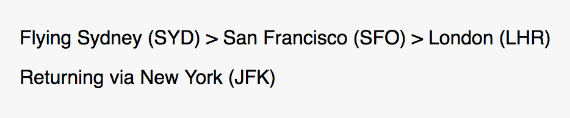

# Airport code explainer

A small utility to expand IATA airport codes in text to avoid having to look them up.

So far this script comes in 2 parts: A standalone JS library and a Chrome browser extension.


## Chrome extension

The extension can be installed at <https://chrome.google.com/webstore/detail/airport-code-explainer/mceehpfaopbngcflhlgkabgjonnngmjf>.

I originally made this just to be lazy when I’m looking at Twitter, so it’s very simple at the moment.
People on social media will often post details of where they’re flying by just referencing airport codes.
This is fine **if** you know which airports the (sometimes obscure) codes refer to.
But when you don’t know, just press the plane icon to add a tooltip to every known airport code found in the current page.


## JS library

The library is available at [src/airport-codes.js](). It exposes a global object of `airportCodes`. (Yep, a global object in this day and age. See the [extra information](#extra-information) section for the reason why.)

The `airportCodes` object has the following methods:

### `setDataPath(path)`

The library relies on a separate data file ([data/codes.json]()) containing all the airport code definitions.
By default, this file is loaded from the relative path of `../data/codes.json`, reflecting the file structure of this repository.

You can override the path to the data file by calling `airportCodes.setDataPath(newPath)` _before_ replacing any codes.
The data file is lazily-loaded. That is, it’s not loaded at all until the first call to `replaceText()` or `replaceElement()`.

### `replaceText(text)`

Finds any IATA codes in a piece of text and replaces them with the airport’s location.
Returns a [`Promise`][promise-api] which resolves to the replaced text.

```js
var oldText = 'Flying SYD > SFO > LHR';
airportCodes.replaceText(oldText).then(function (newText) {
    console.log(newText); // 'Flying Sydney (SYD) > San Francisco (SFO) > London (LHR)'
});
```

### `replaceElement(element[, options])`

Finds any IATA codes within a DOM element and replaces them with the airport’s location.
Returns a [`Promise`][promise-api] which resolves to an array of elements that contain replaced text.

The `element` argument is any DOM element.

An `options` object can also be provided to control the display of the replaced text.
Currently there is only one option — `method`.

* `method: 'abbr'` — This is the default value. IATA codes are replaced by an `<abbr>` element (with class name `airport-codes-inserted`) containing the code as the display text, with the full airport name as a tooltip via the `title` attribute.
* `method: 'expand'` — IATA codes are replaced with the airport’s location as part of the text. This is the equivalent of calling `replaceText()` on the element’s text content.

Given the following DOM structure:

```html
<div id="replace-me">
    <p id="p1">Flying SYD > SFO > LHR</p>
    <p id="p2">Returning via JFK</p>
</div>
```



These are the results of running `replaceElement()` with the different options

#### Option: `method: 'abbr'`

```js
var elem = document.getElementById('replace-me');
airportCodes.replaceElement(elem).then(function (replaced) {
    console.log(replaced);
    /*
    replaced == [ <p id="p1"/>, <p id="p2"> ];
    
    elem DOM structure:

    <div id="replace-me">
        <p id="p1">Flying 
            <abbr title="Sydney Kingsford Smith International Airport, Sydney" class="airport-codes-inserted">SYD</abbr>
            > <abbr title="San Francisco International Airport, San Francisco" class="airport-codes-inserted">SFO</abbr>
            > <abbr title="London Heathrow Airport, London" class="airport-codes-inserted">LHR</abbr>
        </p>
        <p id="p2">Returning via
            <abbr title="John F Kennedy International Airport, New York" class="airport-codes-inserted">JFK</abbr>
        </p>
    </div>
    */
});

// This is the same as above
airportCodes.replaceElement(elem, { method: 'abbr' }).then(function (replaced) {
    console.log(replaced);
});
```



Some default minimal CSS styling for the `abbr` elements is provided in [src/airport-codes.css](), but this is not a requirement. Feel free to provide your own CSS instead.

#### Option: `method: 'expand'`

```js
var elem = document.getElementById('replace-me');
airportCodes.replaceElement(elem, { method: 'expand' }).then(function (replaced) {
    console.log(replaced);
    /*
    replaced == [ <p id="p1"/>, <p id="p2"> ];
    
    elem DOM structure:

    <div id="replace-me">
        <p id="p1">Flying Sydney (SYD) > San Francisco (SFO) > London (LHR)</p>
        <p id="p2">Returning via New York (JFK)</p>
    </div>
    */
});
```




### Extra information

The JS library has a dependency on the ES6 [Promise][promise-api] object. If you’re using an old browser that doesn’t have native promises, you’ll have to include a promise polyfill.

Oh, and I make no apologies about the packaging of this library. It’s a single unminified file that exposes a global object using ES5 syntax. No ES6 module, no UMD compatibiliy, no pre-minified build, and all for a very simple reason: effort vs reward.

The library was written first and foremost for use in the browser extension, but I thought it might be useful as a standalone script as well. But until there’s an actual consumer of the API that requires it, I’m not going to put effort into compiling/transpiling the code for different outputs. The simplest build system is the one that doesn’t exist.


## Credits

* This code is [MIT licensed](LICENSE) open source.
* Airport data provided in the Public Domain by [OurAirports](http://ourairports.com/data/).
* Icon from [EmojiOne](http://emojione.com/), licensed CC-BY 4.0.


[promise-api]: https://developer.mozilla.org/en-US/docs/Web/JavaScript/Reference/Global_Objects/Promise
